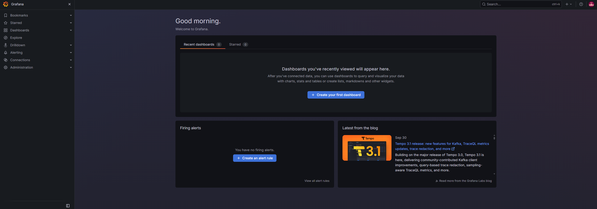
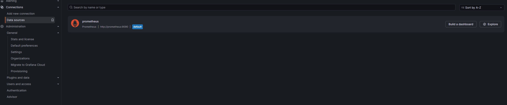
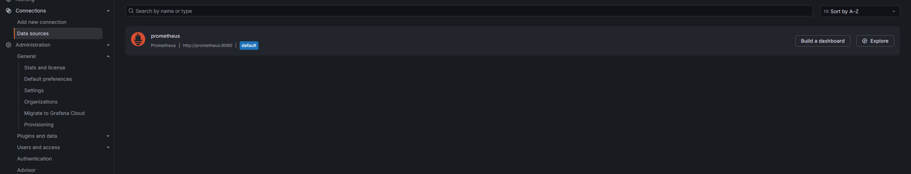
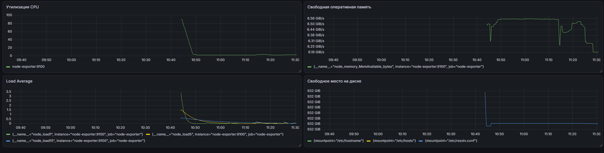

# Домашнее задание к занятию 14 «Средство визуализации Grafana»

## Подготовка окружения.

Для подготовки окружения, я воспользуюсь VS code, терминалом и Docker desktop.
Создал папку, создал docker-compose.yml и по help создал prometheus.yml внутри папки prometheus.

После чего, перейдя в папку с домашней работы выполнил команду docker compose up -d. 
Поднялось три контейнера: 

```
docker ps 
CONTAINER ID   IMAGE                       COMMAND                  CREATED              STATUS              PORTS                                         NAMES
bd5f46d47630   grafana/grafana:latest      "/run.sh"                About a minute ago   Up About a minute   0.0.0.0:3000->3000/tcp, [::]:3000->3000/tcp   grafana
ecfb3d7a94c7   prom/prometheus:latest      "/bin/prometheus --c…"   About a minute ago   Up About a minute   0.0.0.0:9090->9090/tcp, [::]:9090->9090/tcp   prometheus
67c94118f7a8   prom/node-exporter:latest   "/bin/node_exporter"     About a minute ago   Up About a minute   0.0.0.0:9100->9100/tcp, [::]:9100->9100/tcp   node-exporter
```

В результате были запущены три контейнера:
- Grafana;
- Prometheus;
- Node Exporter.

## Задание 1.

### 1.
Запустил всё что нужно ещё в подготовке.

### 2. 

Зашёл в графану:



### 3. 

Подключаем prometheus:



В этой версии Grafana немного в другом месте находится Data sources.

### 4. 

Скриншот с тем, что подключили:



## Задание 2.

Создаем дашборд и подключаем то, что требуется в задании.

утилизация CPU для nodeexporter (в процентах, 100-idle);
CPULA 1/5/15;
количество свободной оперативной памяти;
количество места на файловой системе.

Прмиеры:
Утилизация CPU:

```
100 - (avg by (instance) (rate(node_cpu_seconds_total{mode="idle"}[5m])) * 100)
```

Load average:

За минуту:
```
node_load1
```
За пять минут:
```
node_load5
```
За пятнадцать минут:
```
node_load15
```
Доступная оперативная память:
```
node_memory_MemAvailable_bytes
```
Свободное место на файловой системе:
```
max(node_filesystem_avail_bytes{fstype!~"tmpfs|overlay|squashfs"})
```

На основе этих запросов, сделал дашборд и панели:



### задание 3.

Для каждой панели Dashboard были настроены правила оповещения:
- CPU — загрузка выше 80%;
- Load Average — значение выше 2;
- свободная оперативная память — менее 1 GiB;
- свободное место на диске — менее 10 GiB.


Также поправил (если возникнут вопросы) оперативную память, у меня стояло GBIT/S.

### Задание 4.

Dashboard был экспортирован в JSON и сохранён в файл dashboard.json.